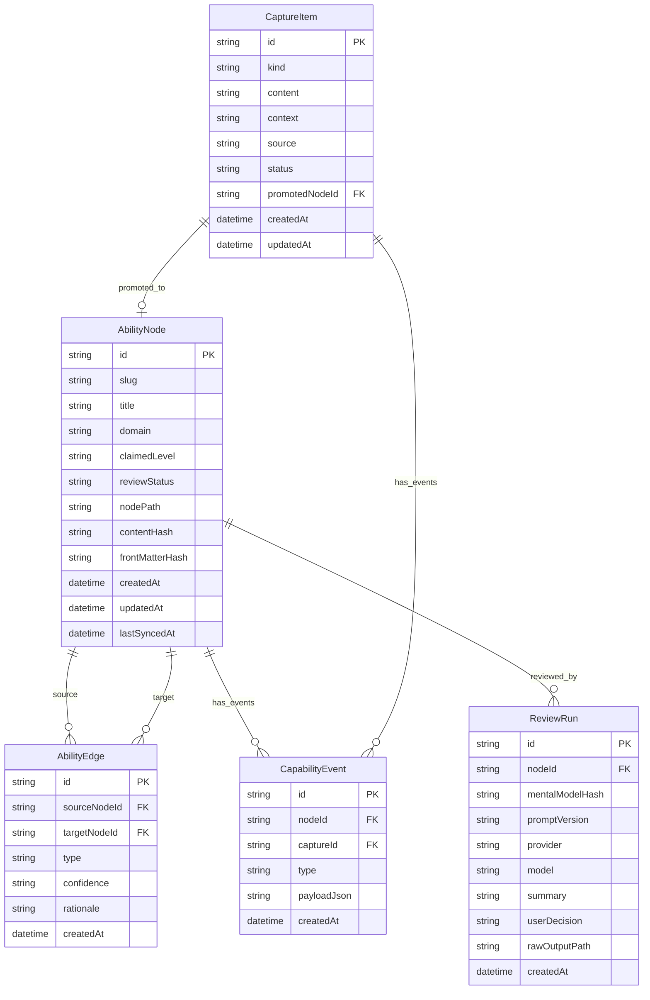

# 数据契约

> HOT 知识。本文件定义 Sycamore 的核心实体、SQLite 表结构草案、Markdown 节点格式和 CLI 契约。修改数据模型或跨模块 API 前必须先更新本文件。

---

# 数据所有权

Sycamore 采用 Markdown + SQLite 双存储，但禁止双重真相。

| 数据 | Single Source of Truth | 说明 |
|------|------------------------|------|
| 用户正文 | Markdown | `Mental Model`、`Cheatsheet`、`Practice Log`、`References`。 |
| 节点基础元数据 | Markdown Front Matter | `id`、`slug`、`title`、`domain`、`claimedLevel`。 |
| 捕获项 | SQLite | CaptureItem 尚未进入正式 Markdown 节点。 |
| 关系和事件 | SQLite | Edge、CapabilityEvent、派生状态。 |
| 新鲜度 | SQLite 派生 | 由事件和时间推导，不写入 Markdown。 |
| ReviewRun | SQLite + JSON 文件 | SQLite 存索引，JSON 存完整原始结果。 |
| 搜索索引 | SQLite | 可重建，不是权威数据。 |

CLI 修改 Markdown Front Matter 时必须写回文件。读取节点前应检查文件 mtime/hash，必要时先执行 sync。

---

# 核心实体

## CaptureItem

低摩擦捕获项。它不是正式能力节点。

| 字段 | 类型 | 必填 | 说明 |
|------|------|------|------|
| `id` | string | 是 | UUID。 |
| `kind` | enum | 是 | `note`、`cheat`、`link`、`snippet`、`question`。 |
| `content` | string | 是 | 捕获正文。 |
| `context` | string | 否 | 捕获时的场景说明。 |
| `source` | string | 否 | URL、文件路径或来源。 |
| `status` | enum | 是 | `inbox`、`promoted`、`archived`、`discarded`。 |
| `promotedNodeId` | string | 否 | 升格后的 AbilityNode。 |
| `createdAt` | datetime | 是 | 创建时间。 |
| `updatedAt` | datetime | 是 | 更新时间。 |

## AbilityNode

正式能力节点，表示一项可校准、可恢复、可实践的能力。

| 字段 | 类型 | 必填 | SSOT | 说明 |
|------|------|------|------|------|
| `id` | string | 是 | Markdown | UUID。 |
| `slug` | string | 是 | Markdown | 文件名和 CLI 友好标识。 |
| `title` | string | 是 | Markdown | 应尽量是能力断言。 |
| `domain` | string | 否 | Markdown | 所属领域。 |
| `claimedLevel` | enum | 是 | Markdown + Event | 用户声明或历史达到的等级。 |
| `reviewStatus` | enum | 是 | SQLite | 评审状态。 |
| `nodePath` | string | 是 | SQLite | Markdown 文件路径。 |
| `contentHash` | string | 是 | SQLite | 最近一次索引时的正文 Hash。 |
| `frontMatterHash` | string | 是 | SQLite | 最近一次索引时的 Front Matter Hash。 |
| `createdAt` | datetime | 是 | Markdown | 创建时间。 |
| `updatedAt` | datetime | 是 | Markdown | 文件更新时间。 |
| `lastSyncedAt` | datetime | 否 | SQLite | 最近同步时间。 |

### claimedLevel 枚举

| 值 | 含义 |
|----|------|
| `L0` | 接触过，但不能独立解释或使用。 |
| `L1` | 看 Cheatsheet 能完成简单任务。 |
| `L2` | 能解释原理并处理常见变化。 |
| `L3` | 能迁移到新场景，能排查复杂问题或教别人。 |

### reviewStatus 枚举

| 值 | 含义 |
|----|------|
| `not_reviewed` | 尚未评审。 |
| `challenged` | 已被 LLM 批判性评审。 |
| `needs_revision` | 评审指出关键问题，用户尚未修订。 |
| `accepted_by_user` | 用户阅读评审后接受当前版本，仍不表示事实正确。 |

禁止使用 `verified` 作为状态名。

## CapabilityEvent

用于推导 freshness、readiness 和历史等级变化。

| 字段 | 类型 | 必填 | 说明 |
|------|------|------|------|
| `id` | string | 是 | UUID。 |
| `nodeId` | string | 否 | 关联能力节点。 |
| `captureId` | string | 否 | 关联捕获项。 |
| `type` | enum | 是 | 事件类型。 |
| `payloadJson` | string | 否 | 事件附加数据。 |
| `createdAt` | datetime | 是 | 事件时间。 |

### type 枚举

- `capture_created`
- `capture_promoted`
- `practice_logged`
- `cheatsheet_queried`
- `review_completed`
- `recovery_passed`
- `recovery_failed`
- `manual_level_changed`
- `node_synced`

## AbilityEdge

能力节点之间的关系。P0 不实现，P1/P2 使用。

| 字段 | 类型 | 必填 | 说明 |
|------|------|------|------|
| `id` | string | 是 | UUID。 |
| `sourceNodeId` | string | 是 | 起点节点。 |
| `targetNodeId` | string | 是 | 终点节点。 |
| `type` | enum | 是 | 关系类型。 |
| `confidence` | enum | 是 | `explicit`、`implicit`、`suggested`、`derived`。 |
| `rationale` | string | 否 | 建立关系的理由。P0 不强制。 |
| `createdAt` | datetime | 是 | 创建时间。 |

## ReviewRun

一次不可变 LLM 评审记录。P1 实现，P0 可先定义 mock 数据结构。

| 字段 | 类型 | 必填 | 说明 |
|------|------|------|------|
| `id` | string | 是 | UUID。 |
| `nodeId` | string | 是 | 被评审节点。 |
| `mentalModelHash` | string | 是 | 被评审内容 Hash。 |
| `promptVersion` | string | 是 | Prompt 版本。 |
| `provider` | string | 是 | LLM Provider。 |
| `model` | string | 否 | 实际模型名。 |
| `summary` | string | 是 | 评审摘要。 |
| `factIssuesJson` | string | 否 | 事实疑点。 |
| `boundaryIssuesJson` | string | 否 | 边界问题。 |
| `questionsJson` | string | 否 | 深度追问。 |
| `practiceSuggestionsJson` | string | 否 | 实践建议。 |
| `userDecision` | enum | 是 | `pending`、`accepted`、`ignored`、`revised`。 |
| `rawOutputPath` | string | 否 | 原始 JSON 归档路径。 |
| `createdAt` | datetime | 是 | 创建时间。 |

---

# ER 图



---

# SQLite 表草案

## capture_items

```sql
CREATE TABLE capture_items (
    id TEXT PRIMARY KEY,
    kind TEXT NOT NULL CHECK (kind IN ('note', 'cheat', 'link', 'snippet', 'question')),
    content TEXT NOT NULL,
    context TEXT,
    source TEXT,
    status TEXT NOT NULL CHECK (status IN ('inbox', 'promoted', 'archived', 'discarded')),
    promoted_node_id TEXT,
    created_at TEXT NOT NULL,
    updated_at TEXT NOT NULL,
    FOREIGN KEY (promoted_node_id) REFERENCES ability_nodes(id)
);
```

## ability_nodes

```sql
CREATE TABLE ability_nodes (
    id TEXT PRIMARY KEY,
    slug TEXT NOT NULL UNIQUE,
    title TEXT NOT NULL,
    domain TEXT,
    claimed_level TEXT NOT NULL CHECK (claimed_level IN ('L0', 'L1', 'L2', 'L3')),
    review_status TEXT NOT NULL CHECK (
        review_status IN ('not_reviewed', 'challenged', 'needs_revision', 'accepted_by_user')
    ),
    node_path TEXT NOT NULL UNIQUE,
    content_hash TEXT NOT NULL,
    front_matter_hash TEXT NOT NULL,
    created_at TEXT NOT NULL,
    updated_at TEXT NOT NULL,
    last_synced_at TEXT
);
```

## capability_events

```sql
CREATE TABLE capability_events (
    id TEXT PRIMARY KEY,
    node_id TEXT,
    capture_id TEXT,
    type TEXT NOT NULL CHECK (
        type IN (
            'capture_created',
            'capture_promoted',
            'practice_logged',
            'cheatsheet_queried',
            'review_completed',
            'recovery_passed',
            'recovery_failed',
            'manual_level_changed',
            'node_synced'
        )
    ),
    payload_json TEXT,
    created_at TEXT NOT NULL,
    FOREIGN KEY (node_id) REFERENCES ability_nodes(id) ON DELETE CASCADE,
    FOREIGN KEY (capture_id) REFERENCES capture_items(id) ON DELETE CASCADE
);
```

## ability_edges

```sql
CREATE TABLE ability_edges (
    id TEXT PRIMARY KEY,
    source_node_id TEXT NOT NULL,
    target_node_id TEXT NOT NULL,
    type TEXT NOT NULL CHECK (
        type IN ('prerequisite', 'related', 'similar_pattern', 'contrasts_with', 'used_in_scenario')
    ),
    confidence TEXT NOT NULL CHECK (confidence IN ('explicit', 'implicit', 'suggested', 'derived')),
    rationale TEXT,
    created_at TEXT NOT NULL,
    FOREIGN KEY (source_node_id) REFERENCES ability_nodes(id) ON DELETE CASCADE,
    FOREIGN KEY (target_node_id) REFERENCES ability_nodes(id) ON DELETE CASCADE,
    UNIQUE (source_node_id, target_node_id, type)
);
```

## review_runs

```sql
CREATE TABLE review_runs (
    id TEXT PRIMARY KEY,
    node_id TEXT NOT NULL,
    mental_model_hash TEXT NOT NULL,
    prompt_version TEXT NOT NULL,
    provider TEXT NOT NULL,
    model TEXT,
    summary TEXT NOT NULL,
    fact_issues_json TEXT,
    boundary_issues_json TEXT,
    questions_json TEXT,
    practice_suggestions_json TEXT,
    user_decision TEXT NOT NULL CHECK (user_decision IN ('pending', 'accepted', 'ignored', 'revised')),
    raw_output_path TEXT,
    created_at TEXT NOT NULL,
    FOREIGN KEY (node_id) REFERENCES ability_nodes(id) ON DELETE CASCADE
);
```

---

# Markdown 节点格式

```markdown
---
id: "uuid"
slug: "shell-pipeline-log-processing"
title: "我能用 Shell 管道快速处理日志"
domain: "shell"
claimedLevel: "L1"
createdAt: "2026-06-11T00:00:00+08:00"
updatedAt: "2026-06-11T00:00:00+08:00"
---

# 我能用 Shell 管道快速处理日志

## Capability

我能在命令行中组合管道、重定向和文本过滤工具，快速从日志中定位关键信息。

## Mental Model

### Core Idea

用自己的话解释这个能力解决什么问题，以及背后的机制。

### Boundaries

- 适合什么场景。
- 不适合什么场景。
- 容易误用在哪里。

## Cheatsheet

只放低频但实操必要的命令、参数和配置。

## Practice Log

### 2026-06-11

- 场景：
- 操作：
- 结果：
- 踩坑：

## Review Notes

只保存人类可读摘要和 ReviewRun ID。

## References

- 参考资料链接或本地资产路径。
```

---

# CLI 命令契约

## syca init

初始化本地数据目录、配置文件和 SQLite schema。

```bash
syca init
```

## syca capture

低摩擦捕获，不创建正式能力节点。

```bash
syca capture --note "awk 字段分隔符今天踩坑"
syca capture --cheat "awk '{print $1}' access.log | sort | uniq -c"
syca capture --link "https://example.com/shell-awk"
```

## syca inbox

查看待处理捕获项。

```bash
syca inbox
```

## syca promote

将 CaptureItem 升格为 AbilityNode。

```bash
syca promote
syca promote --latest
syca promote --index 2
syca promote a1b2c3d4
syca promote <capture-id> --title "我能查看 Kubernetes Pod" --domain docker
```

选择规则（互斥，只能用一种）：

| 形式 | 说明 |
|------|------|
| `syca promote`（无参） | 升格最新 inbox 条目（与 `--latest` 相同）。 |
| `syca promote --latest` | 升格最新 inbox 条目。 |
| `syca promote --index <n>` | 按 `syca inbox` 列表序号（1-based）升格。 |
| `syca promote <id-or-prefix>` | 完整 UUID 或唯一 UUID 前缀。 |

`syca inbox` 显示 `#` 序号与 ID 前 8 位，便于 `--index` 与前缀匹配。

行为：

- 生成 Markdown 节点。
- 写入 Front Matter。
- 插入 ability_nodes 索引。
- 更新 capture_items 状态为 `promoted`。
- 记录 `capture_promoted` 事件。

## syca query

查询正式节点，不默认查询 archived/discarded 捕获项。

```bash
syca query "awk" --cheat
```

## syca sync

读取 Markdown 权威字段，更新 SQLite 索引。

```bash
syca sync
```

## syca doctor

检查一致性。

```bash
syca doctor
```

必须检查：

- SQLite 指向的 Markdown 是否存在。
- Markdown Front Matter 是否缺少必需字段。
- 文件 hash 是否与索引一致。
- 是否存在孤儿 Markdown。
- 是否存在无效 Edge。

## syca practice

向节点 Practice Log 追加一条实践记录。

```bash
syca practice <node-id> --note "quick note"
syca practice <node-id> --scenario "..." --action "..." --result "..." --pitfall "..."
```

行为：

- 在 Markdown `## Practice Log` 顶部追加带时间戳条目。
- 更新 Front Matter `updatedAt` 与 SQLite 索引 hash。
- 记录 `practice_logged` 事件。

## syca level set

手动更新节点 `claimedLevel`。

```bash
syca level set <node-id> L2
```

行为：

- 写回 Markdown Front Matter `claimedLevel`。
- 更新 SQLite `ability_nodes.claimed_level`。
- 记录 `manual_level_changed` 事件（payload 含 `previousLevel` / `newLevel`）。

## syca status --stale

基于 `CapabilityEvent` 与节点创建时间推导新鲜度，列出 stale 节点。

```bash
syca status --stale
```

默认阈值：`config.toml` 中 `[freshness] stale_after_days = 30`。

计入新鲜度的活动事件：`practice_logged`、`cheatsheet_queried`、`review_completed`、`recovery_passed`、`manual_level_changed`。

## syca review

P1 命令。创建 ReviewRun，不覆盖用户原文。

```bash
syca review <node-id> --dry-run
syca review <node-id>
```

Provider 由 `config.toml` 的 `[llm]` 段控制。默认 provider 为 `deepseek`（`enabled = false` 时 CLI 仍使用 mock）。

```toml
[llm]
enabled = true
provider = "deepseek"
base_url = "https://api.deepseek.com"
model = "deepseek-v4-pro"
api_key_env = "DEEPSEEK_API_KEY"
```

API Key 通过根目录或 `SYCA_HOME` 下的 `.env` 提供（见 `.env.example`）。启用 `provider = "http"` 时需配置 `endpoint`。

节点 Front Matter 可设置 `llmAllowed: false` 禁止发送评审。

## syca reviews

查看与处理 ReviewRun。

```bash
syca reviews list <node-id>
syca reviews accept <review-id>
syca reviews ignore <review-id>
syca reviews revised <review-id>
```

`list` 输出 `Outdated=yes` 表示 ReviewRun 的 `mentalModelHash` 与当前 Mental Model 不一致。

`accept` → 节点 `reviewStatus = accepted_by_user`；`revised` → `needs_revision`；`ignore` 保持 `challenged`。

## syca recover

P2 命令。展示 Recovery Drill（Mental Model + Cheatsheet），用户自评后记录结果。

```bash
syca recover <node-id>
syca recover <node-id> --pass
syca recover <node-id> --fail [--note "..."]
```

无 `--pass` / `--fail` 时仅展示 drill；带 flag 时记录 `recovery_passed` 或 `recovery_failed` 事件（计入新鲜度）。

## syca link

手动建立节点关系（`ability_edges` 表）。

```bash
syca link <source> <target> --type prerequisite [--rationale "..."]
```

`--type` 可选：`prerequisite`、`related`、`similar_pattern`、`contrasts_with`、`used_in_scenario`。默认 `explicit` confidence。

## syca graph

```bash
syca graph --domain shell
```

列出指定 domain 内节点及其边（文本列表）。

## syca status --domain

```bash
syca status --domain backend
```

列出 domain 内各节点新鲜度（fresh / stale）。

---

# JSON 输出格式

使用 `--json` 时统一输出：

```json
{
  "code": 200,
  "message": "success",
  "data": {}
}
```

错误示例：

```json
{
  "code": 409,
  "message": "slug already exists",
  "data": {
    "slug": "shell-pipeline-log-processing"
  }
}
```
